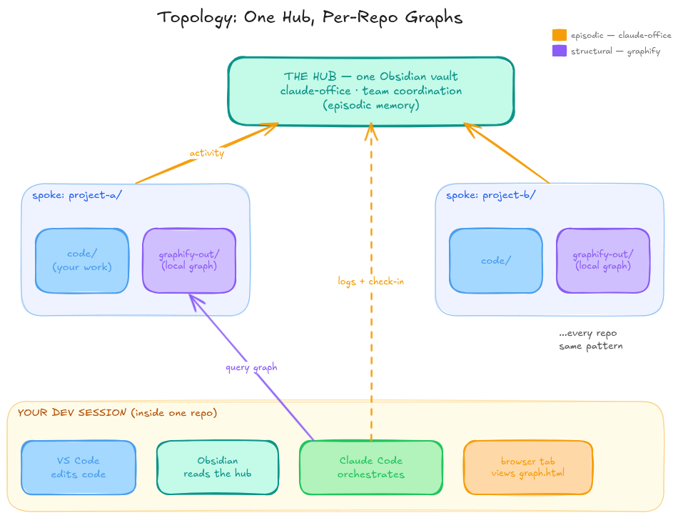

# Integrations: Pairing claude-office with a Memory Layer

← [Back to README](README.md)

claude-office is one *kind* of memory: **episodic** — the time-ordered narrative of who did what. This note explains how to pair it with other memory tools **without modifying claude-office's code**. It is a setup recipe, not a feature.

---

## The Pattern: Memory as a Swappable Layer

claude-office does not own "memory" — it owns *one layer of it*. Other layers can plug in alongside it, as long as they speak a shared protocol (today, that protocol is **MCP** and **git-synced files**).

Think of it like membranes and signals: each memory tool is its own organ, and they communicate through standard channels rather than being fused together. Swap one out, the others keep working.

This means you should treat every new memory tool you encounter not as "the memory system" but as **a candidate layer** with a specific job. The question is never "should I replace claude-office?" — it's "what layer is this, and does it compose cleanly?"

---

## Worked Example: claude-office + graphify

The cleanest pairing today. The two tools sit on different axes:

| | claude-office | graphify |
|---|---|---|
| Memory type | Episodic (what happened) | Structural (how things connect) |
| Input | Session prompts + file changes | Source code, schemas, docs |
| Storage | Git-synced markdown in the vault | `graphify-out/` committed per repo |
| Interface | Hooks + slash commands | CLI + MCP server |
| Lock-in | None (plain files) | None (plain files) |

**Topology**:



- **One** Obsidian vault — the hub. Singular. Do not create a vault per repo.
- **graphify runs in each spoke repo**, dropping `graphify-out/` into that repo's git. No `--obsidian` flag needed — graphify ships its own `graph.html` viewer.
- During a dev session, **Claude Code** is the orchestrator: it queries the local graph *and* logs activity up to the hub. VS Code edits code, Obsidian reads the hub, a browser tab views the graph. Four views, one session, no extra vault.

**Setup sketch** (per spoke repo, after claude-office is already set up):

```bash
# install graphify once per machine
uv tool install graphifyy
graphify install            # registers the /graphify skill in Claude Code

# inside a project repo:
/graphify .                 # builds graphify-out/ (commit it)
graphify hook install       # auto-rebuilds the graph on each commit
```

Now `/check-in` gives you episodic context, and `/graphify query "..."` gives you structural context. They never touch each other's files.

---

## A Rubric for the Other Memory Tools

New memory tools appear constantly. Rather than test each blindly, score it on six axes. The pattern above works best with tools that land on the **left** of each axis.

| Axis | Composes easily ✅ | Heavier / more lock-in ⚠️ |
|---|---|---|
| **Memory type** | Fills a gap you don't have yet | Overlaps something you already run |
| **Storage** | File-based, git-syncable | Server + database |
| **Hosting** | Local-first, runs offline | Cloud-dependent |
| **Interface** | Speaks MCP / CLI | Proprietary SDK only |
| **Sovereignty** | Plain formats, easy to rip out | Data trapped in a service |
| **Setup weight** | Minutes to trial | Docker + DB + keys to even test |

The bias is deliberate: prefer tools you can **trial in an afternoon and remove without trace**. A memory layer becomes load-bearing fast — keep the exit cheap.

---

## Placing Three Tools on the Rubric

| | claude-office | graphify | supermemory |
|---|---|---|---|
| Memory type | Episodic | Structural | Fact-tracking (per-entity, over time) |
| Storage | Files + git | Files + git | Server + Postgres + vector DB |
| Hosting | Local | Local | Cloud-first (self-host = enterprise tier) |
| Interface | Hooks + commands | CLI + MCP | MCP + REST + SDK |
| Sovereignty | Full | Full | Partial (data in the service) |
| Setup weight | Light | Medium | Heavy |

**Reading it:**

- **graphify** composes cleanly — same storage and sovereignty profile as claude-office. Easy yes for code-heavy repos.
- **supermemory** is genuinely capable (it tracks facts across Gmail, Notion, GitHub, resolves contradictions, auto-forgets stale info), but it is a *service*, not a folder. It only earns its weight if you need **cross-source fact memory** that neither episodic nor structural layers provide — and you accept running infrastructure. For a git-synced coordination vault, it is likely premature. Revisit it when "what does the system know about person/entity X across all sources" becomes a real recurring question.

**Rule of thumb:** start with the file-based, MCP-speaking, local-first layers. Reach for a server-based memory engine only when a concrete need can't be met any other way — and when you do, keep its data export path in view from day one.

---

*This note is documentation only. No code in this fork depends on graphify, supermemory, or any external memory tool. They are optional companions.*
